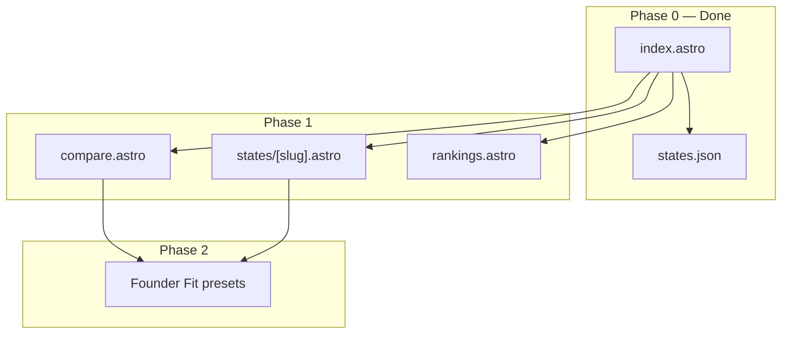
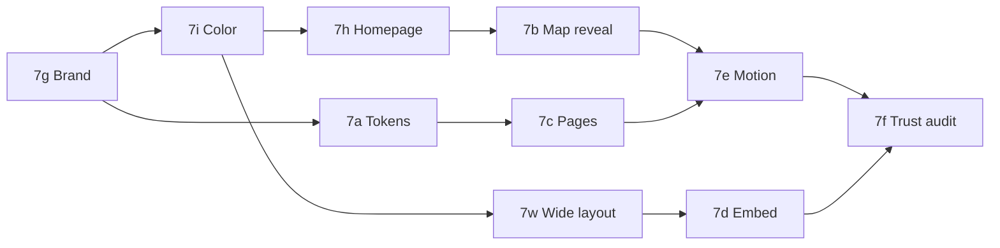

# StateCompass Roadmap

> **Product:** Site selection for founders — compare where to build and operate your business, powered by CNBC.  
> **How to use in Cursor:** *"Read `docs/ROADMAP.md`. Phases 0–6 are done — implement Phase 7g only."* Update the phase status table as you finish each phase.

---

## North star

**One sentence:** Compare US states for business climate, cost, and operational friction — ranked, visual, sourced — for founders and operators, not for everyone.

**The Zillow wedge:** Founders should send a **StateCompass compare link** in Slack instead of screenshotting ChatGPT. Chat gives prose; StateCompass gives **linkable, visual, CNBC-sourced evidence**.

**What we are not building:** General AI chat, full legal/compliance filing, student/trivia use cases, or a second competing score from unrelated sources.

---

## Who this is for

| Build for | Do not build for |
|-----------|------------------|
| Early startup founders choosing HQ or first expansion | Students, casual US trivia |
| Small business owners opening a second location | "Ask anything about business" (ChatGPT's job) |
| Operators/advisors doing lightweight site selection | Replacing lawyers, accountants, or Clerky/Harbor |

**Copy and UX tone:** co-founder, HQ, expand, board deck, site selection — not classroom or encyclopedia.

---

## Phase status

| Phase | Name | Status |
|-------|------|--------|
| **0** | Baseline (explore layer) | **Done** |
| **1** | Compare & discover | **Done** |
| **2** | Founder Fit | **Done** |
| **3** | Share & be found | **Done** |
| **4** | Founder Snapshot | **Done** |
| **5** | Memory & time | **Done** |
| **6** | Distribution | **Done** |
| **7** | UI/UX overhaul — presentation layer | **Planned** (implement next) |

**Estimated scope:** Phases 0–6 = core product (complete). Phase 7 = identity, pure-dark visual system, homepage choreography, and polish — ship as vertical slices **7g → 7i → 7h → 7b → …** (see below).

---

## Trust principles (every phase)

These rules apply to **all** phases. Trust is the product.

1. **Scores are sacred** — All ranks and category point totals come from CNBC via `generate_states.py` / `verify.py`. Never hand-edit scores in UI or content.
2. **Attribute CNBC** — Footer, methodology link, year label (e.g. "CNBC 2025") on every page that shows scores.
3. **Two data lanes** — (A) CNBC competitiveness scores; (B) operational facts in Founder Snapshot with **source links**. Do not blend into an unexplained "StateCompass number."
4. **Disclaimers on guidance** — Snapshot content is informational, not legal/tax advice.
5. **Ship vertical slices** — One flow end-to-end (e.g. compare TX vs NC vs FL) before scaling to 50 states.
6. **Phase gate** — Do not start the next phase until current exit criteria pass and you would send the link to a founder without apologizing.

---

## Data strategy

**Core engine:** [CNBC America's Top States for Business](https://www.cnbc.com/2025/07/10/top-states-for-business-americas-2025-the-full-rankings.html) — 50 states, 10 categories, 2,500 max points.

| Category key | Label | Max points |
|--------------|-------|------------|
| `economy` | Economy | 445 |
| `infrastructure` | Infrastructure | 405 |
| `workforce` | Workforce | 335 |
| `costOfDoingBusiness` | Cost of Doing Business | 295 |
| `businessFriendliness` | Business Friendliness | 270 |
| `qualityOfLife` | Quality of Life | 265 |
| `technologyAndInnovation` | Technology & Innovation | 255 |
| `education` | Education | 110 |
| `accessToCapital` | Access to Capital | 60 |
| `costOfLiving` | Cost of Living | 60 |

**Pipeline (existing):**

```
scripts/fetch_cnbc_categories.py  →  data/cnbc_categories.json
scripts/generate_states.py        →  public/data/states.json
scripts/verify.py                 →  CI gate (50 states, 10 categories, sums)
```

**Methodology:** [How CNBC chooses Top States 2025](https://www.cnbc.com/2025/06/11/how-we-are-choosing-americas-top-states-for-business-in-2025.html)

**Future data (Phase 4+):** Public facts only for Founder Snapshot — tax posture, SOS links, compliance calendar *lite* — each field sourced, not scored.

---

## Architecture

**Decision:** Stay on **Astro** (static generation, Vercel/Netlify, incremental layers on Phase 0).

**Target structure (full vision):**

```
src/
  pages/
    index.astro              # Map home (Phase 0)
    compare.astro            # Phase 1
    rankings.astro           # Phase 1
    states/[slug].astro      # Phase 1 — 50 static pages
  components/
    Header.astro             # Nav: Map | Rankings | Compare
    ComparePanel.astro       # Phase 1
    CategoryChart.astro      # Phase 1 — CSS bar charts
    FounderFitSelector.astro # Phase 2
    FounderSnapshot.astro    # Phase 4
  layouts/Layout.astro
  scripts/
    map.js, search.js, categories.js   # Phase 0
    compare.js, founderFit.js        # Phase 1–2
public/
  data/states.json
  assets/
scripts/
  fetch_cnbc_categories.py, generate_states.py, verify.py
data/
  cnbc_categories.json
  founder_snapshots.json     # Phase 4 — sourced facts per state
```

**Hosting:** Vercel (recommended) or Netlify.



---

## Product layers (build order)

Lower layers must stay trustworthy before upper layers ship.

```
┌─────────────────────────────────────────┐
│  Phase 7 — Presentation (identity, UX)    │
├─────────────────────────────────────────┤
│  Phase 6 — Distribution (embed, API)    │
├─────────────────────────────────────────┤
│  Phase 5 — Memory (multi-year, alerts)  │
├─────────────────────────────────────────┤
│  Phase 4 — Founder Snapshot (facts)     │
├─────────────────────────────────────────┤
│  Phase 3 — Share & SEO & OG               │
├─────────────────────────────────────────┤
│  Phase 2 — Founder Fit (derived scores)   │
├─────────────────────────────────────────┤
│  Phase 1 — Compare, pages, rankings     │
├─────────────────────────────────────────┤
│  Phase 0 — CNBC data + map + search  ✓   │
└─────────────────────────────────────────┘
```

---

## Phase 0 — Baseline (explore layer) — **Done**

**Goal:** Credible CNBC-powered map experience — explore one state, glimpse why it ranks.

**Inventory (do not rebuild unless broken):**

| Area | Location | Notes |
|------|----------|-------|
| Map + pin + URL sync | `src/scripts/map.js` | `?state=TX`, keyboard, mobile bottom sheet |
| Search autocomplete | `src/scripts/search.js` | Accessible combobox |
| Category sidebar | `src/pages/index.astro`, `categories.js` | Top 3 strengths / bottom 3 weaknesses |
| CNBC 2025 data | `public/data/states.json` | Real point totals, 10 categories per state |
| Data pipeline | `scripts/fetch_cnbc_categories.py`, `generate_states.py`, `verify.py` | CI on every build |
| Infra | Astro, CI, Vercel/Netlify, sitemap, 404 | Production-ready |

**Exit criteria:** *(Met.)* User can search or pin a state, see score/rank/tier and category strengths/weaknesses, share URL.

**Functional completeness (niche):** ~35–40% of full founder product — explore only, not decide.

---

## Phase 1 — Compare & discover — **Done**

**Goal:** Turn StateCompass from a map into a **decision tool** — compare states, browse rankings, deep-dive per state.

**Depends on:** Phase 0 data and `categories.js`.

### 1a. State detail pages

- Route: `/states/[slug]` (e.g. `/states/texas`) — add `slug` to JSON at build time
- Content: hero score, rank badge, tier, **full 10-category breakdown** with CSS horizontal bars
- CTAs: "Compare with…", link back to map with state pinned
- SEO: unique `<title>`, meta description, canonical URL
- Generate all 50 pages at Astro build time from `states.json`

### 1b. Compare page

- Route: `/compare?states=NC,TX,FL` (2–3 states max)
- Side-by-side: overall score, rank, tier
- Category rows with bars; **highlight winner** per category (best rank = lowest number)
- Add state dropdown + remove chips; invalid slugs handled gracefully
- Shareable URL updates via `history.replaceState`

### 1c. Rankings table

- Route: `/rankings`
- Columns: rank, state name, score (/100), tier
- Sort by rank (default), score, name
- Filter by tier (green / yellow / red)
- Row click → state detail page

### 1d. Navigation & consistency

- Header nav: **Map** | **Rankings** | **Compare**
- Breadcrumbs on detail pages
- Reuse `categories.js` labels everywhere — same 10 names on map, compare, detail, rankings

### Deliverables

- [x] `slug` field in `generate_states.py` output
- [x] `src/pages/states/[slug].astro` + `getStaticPaths`
- [x] `src/pages/compare.astro` + `src/scripts/compare.js`
- [x] `src/pages/rankings.astro`
- [x] Shared `CategoryChart` component (CSS bars)
- [x] Header nav updated
- [x] Sitemap includes new routes

### Exit criteria

- `/states/texas` is live, indexable, shows all 10 categories with bars
- Compare works for 2–3 states with winner highlighting; URL is shareable
- Rankings sort/filter works; links to detail pages
- `npm run build` + `verify.py` green
- Mobile: compare and detail usable on phone

**Functional completeness after Phase 1:** ~75%

---

## Phase 2 — Founder Fit — **Done**

**Goal:** Personalized ranking — **"best states for my type of business"** — your derived layer on CNBC data (the "Zestimate moment").

**Depends on:** Phase 1 compare + detail (reuse category scores).

### Concept

Fixed **business profiles** re-weight CNBC categories (weights documented in repo, not black-box AI):

| Profile | Emphasized categories (example) |
|---------|----------------------------------|
| **Tech startup** | Workforce, Technology & Innovation, Access to Capital |
| **Bootstrapped services** | Cost of Doing Business, Cost of Living, Business Friendliness |
| **Physical ops / logistics** | Infrastructure, Economy, Workforce |

For each profile: compute **Founder Fit score** (weighted sum of category scores normalized to 0–100) and **rank 50 states** for that profile.

### Deliverables

- [x] `src/scripts/founderFit.js` — profiles, weights, scoring (transparent formula in code comments)
- [x] Profile selector on home, compare, and/or dedicated `/rankings?profile=tech` view
- [x] Rankings table mode: "Overall (CNBC)" vs "Founder Fit: Tech startup"
- [x] Copy explains: "Derived from CNBC 2025 category scores — not CNBC's official overall rank"
- [x] Unit tests or verify script checks weight sums and score bounds

### Exit criteria

- User selects "Tech startup" and sees a re-ordered state list different from overall CNBC rank
- Formula is documented; scores traceable to CNBC category points
- Compare page can show Founder Fit rank alongside CNBC rank (optional column)

**Functional completeness after Phase 2:** ~82%

---

## Phase 3 — Share & be found

**Goal:** Trust, consistency, and viral loop — professional enough for Slack and investor decks; discoverable on Google.

**Depends on:** Phase 1 pages (OG targets exist).

### Deliverables

- [x] **Share UX:** "Copy compare link" button; optional "Copy state link"
- [x] **Export (MVP):** Print-friendly CSS or one-page PDF via browser print for compare view
- [x] **OG images:** Build-time social cards per state (extend `scripts/generate_og.py` or Astro assets)
- [x] **JSON-LD** on state detail pages (`WebPage`, dataset reference to CNBC)
- [x] **Consistency pass:** terminology, footer (source, year, methodology), tier colors, category names
- [x] **Performance:** preload `states.json` on map; self-host fonts if not already
- [x] **Accessibility:** focus rings, contrast check, `aria-live` on compare updates
- [x] Update [`README.md`](../README.md) positioning to founder/site-selection language

### Exit criteria

- Pasting `/compare?states=TX,NC` in iMessage/Slack shows sensible OG preview
- Lighthouse 90+ Performance/Accessibility/SEO on home + one detail page
- No broken meta or duplicate titles across 50 state pages

**Functional completeness after Phase 3:** ~88%

---

## Phase 4 — Founder Snapshot — **Done**

**Goal:** Lite operational context per state — **what to know before operating here** — without becoming a compliance product.

**Depends on:** Phase 1 state detail pages (host Snapshot section).

### Content (informational only)

Per state, sourced public facts:

- Corporate / income tax posture (high level + link)
- Secretary of State / business registration link
- **Compliance calendar lite:** franchise tax / annual report exists? typical timing? link to official site
- **Multi-state heads-up:** 3–5 bullets (nexus awareness, remote workers) — with "Not legal advice" banner

### Data approach

- New file: `data/founder_snapshots.json` (or CSV → JSON)
- Each fact: `{ "value": "...", "sourceUrl": "...", "sourceLabel": "..." }`
- Start with **3 states perfect** (TX, NC, DE), then scale to 50
- No Snapshot field ships without a source URL

### Deliverables

- [x] Schema + validation in `verify.py` for snapshot fields
- [x] `FounderSnapshot.astro` component on state detail pages
- [x] Prominent disclaimer component
- [x] Document data sourcing process in `docs/DATA.md` (optional) or inline in roadmap

### Exit criteria

- 50 states have Snapshot block OR clearly marked "Coming soon" only for states without verified data — prefer all 50 before marking phase done
- Every displayed fact links to official or reputable source
- Legal disclaimer visible on Snapshot sections

**Functional completeness after Phase 4:** ~93%

---

## Phase 5 — Memory & time

**Goal:** Reasons to **return** when rankings update or saved states move.

**Depends on:** Phase 1–3 stable URLs and data schema.

### Deliverables

- [x] **Multi-year CNBC:** `year` dimension in JSON; ingest 2026 when published; year selector on map/rankings
- [x] **YoY movers:** "Biggest risers/fallers" view (overall or per category)
- [x] **Saved states / comparisons:** localStorage first (no accounts); restore on visit
- [x] **Email capture (optional):** "Notify me when 2026 rankings drop" — e.g. Buttondown, ConvertKit
- [x] **Changelog note** on site when new CNBC year ingested

### Exit criteria

- Two years of data display correctly with year toggle
- User can save 2–3 states or a comparison and see them on return (same browser)
- YoY view shows at least overall rank change per state

**Functional completeness after Phase 5:** ~97%

---

## Phase 6 — Distribution

**Goal:** StateCompass as **infrastructure** — others embed and cite you.

### Deliverables

- [x] **Embeddable widget:** iframe-friendly map or compare snippet (read-only, attribution required)
- [x] **Public API (optional):** read-only JSON endpoints for state/compare — rate-limited static export or edge function
- [x] **Partner page:** "For accelerators & VCs" — how to link/embed
- [x] **Analytics:** Plausible events for compare, share, profile selection

### Exit criteria

- Third party can embed map or compare with CNBC attribution
- API (if shipped) serves same data as `states.json` — no drift

**Functional completeness after Phase 6:** product complete for founder wedge.

---

## Phase 7 — UI/UX overhaul — presentation layer

**Goal:** Redesign the **outer model** — how StateCompass presents itself — after Phases 0–6 made the tools work. Founders should open the homepage and immediately see the full US map (no “where is TX?”), trust the B&W brand in the browser tab, and feel an Apple-esque level of restraint: **black stage, white needle, gray evidence, CNBC sourced.**

**Depends on:** Phases 0–6 complete. Trust principles unchanged — scores still sacred, CNBC attributed, disclaimers intact.

**Out of scope for Phase 7:** New data features, accounts, AI chat, light mode, UI sounds (no autoplay audio — ever).

### Design rules (lock before building)

| Rule | Choice |
|------|--------|
| **Brand** | Black & white only — compass needle mark, no green in logo/favicon |
| **Wordmark** | **StateCompass** in Sora 600 (Linear-style casing; domain stays `statecompass.app`) |
| **Body UI** | Inter — do not replace; shorten copy where chrome competes with the map |
| **Level** (how good is a state?) | **Luminance** on map, badges, legend — bright / mid / dark gray tiers |
| **Direction** (did rank go up or down?) | **Green ↑ / red ↓ on Movers only** — hue means movement, not tier |
| **Compare winner** | White emphasis (stroke, weight, brightness) — not green |
| **One-liner** | *Hue is for movement. Level is luminance. Brand is black and white.* |

### Color zones

```
┌─────────────────────────────────────────┐
│  BRAND        Logo, favicon, nav chrome   B&W only      │
├─────────────────────────────────────────┤
│  LEVEL        Map fills, tier badges      Grayscale tiers │
├─────────────────────────────────────────┤
│  DIRECTION    Movers dumbbells, YoY Δ     Green ↑ Red ↓   │
├─────────────────────────────────────────┤
│  COMPARE      Category winner highlight   White emphasis  │
└─────────────────────────────────────────┘
```

**Pure dark tokens (target):**

| Token | Value |
|-------|-------|
| `--bg` | `#000000` (flat — remove radial gradient haze) |
| `--surface` | `#0a0a0a` |
| `--surface-raised` | `#111111` |
| `--border` | `#1a1a1a` |
| `--text` | `#fafafa` |
| `--muted` | `#888888` |
| Tier top (ranks 1–17) | `#e8e8e8` |
| Tier mid (18–34) | `#6b6b6b` |
| Tier lower (35–50) | `#2a2a2a` |

CNBC tier **logic** (1–17 / 18–34 / 35–50) stays; only the **encoding** shifts from green/yellow/red to grayscale on the map and badges.

### Recommended build order



Ship **one sub-section per PR** unless explicitly combined.

---

### 7g — Brand identity (logo & favicon) — **Done**

**Goal:** Replace the generic US map green silhouette with a top-notch, Apple-esque compass needle — especially in the **browser tab**, where identity matters most.

**Mark spec:**

- **Favicon / tab icon (32×32, must read at 16×16):** white compass needle + center hub on `#000000` rounded square (`rx ≈ 7`). ~40° NE tilt; north leg longer than south; rounded stroke caps. **No green, no gradient, no map.**
- **Header lockup:** same needle (24–28px) + **StateCompass** wordmark in Sora 600, `#fafafa`.
- **Retire** US silhouette from `scripts/generate_logo.py` for brand assets (map stays on the homepage; brand mark ≠ geography clipart).

**Deliverables**

- [x] New `assets/logo.svg` + `public/assets/logo.svg` (needle + wordmark)
- [x] New `assets/favicon.svg` + `public/assets/favicon.svg`
- [x] `apple-touch-icon` (180×180) — same geometry, scaled
- [x] Update `Header.astro` brand image / alt
- [x] OG template watermark in `scripts/generate_og.py` / `generate-og.mjs` — small needle, B&W
- [x] Remove or repurpose `generate_logo.py` silhouette pipeline

**Exit criteria:** Tab icon is readable at 16px; header and favicon use the **same** mark; zero green in brand assets.

---

### 7i — Pure dark & grayscale tiers — **Done**

**Goal:** Extreme dark mode + white/gray UI; map tiers encoded by **brightness**, not traffic-light colors.

**Deliverables**

- [x] Update `:root` tokens in `src/styles/styles.css` (pure black bg, surface steps, no page gradient)
- [x] `map.js` — `TIER_COLORS` / glows → grayscale luminance; update default state fill
- [x] Legend swatches, `.tier-badge`, `.score-bar-fill`, rankings tier filter labels — grayscale (keep tier **names** in copy)
- [x] **Movers unchanged semantically** — keep green ↑ / red ↓ for direction (optionally soften tones for pure-black bg)
- [x] Compare winner styling → white emphasis, not green
- [x] Regenerate OG cards if tier accent colors change on social previews
- [x] Embed layouts inherit new tokens

**Exit criteria:** Homepage map reads top/mid/lower tiers at a glance without green/yellow/red fills; Movers still shows up/down in green/red; `npm run build` + `verify.py` green (scores untouched).

---

### 7h — Homepage choreography (map visible on open)

**Goal:** User lands on `/` and sees the **full continental US map** without scrolling — no “cool website, where’s TX?”. Search and year stay; chrome compresses.

**Problems to fix (current):**

- Header eats ~20–30% viewport (logo, 5 nav items, long subtitle, search, hint) before map starts.
- `.map-legend` uses `justify-content: space-between` — tier swatches float in a wide empty bar.
- **CNBC year shown twice:** `YearSelector` dropdown (`CNBC 2025`) + `map-legend-source` span (`CNBC 2025`) beside legend.

**Deliverables**

- [ ] **Short home-only subtitle** (SEO description stays long in `<meta>`), e.g. *Site selection for founders — CNBC scores & shareable compare.*
- [ ] **Move search** from header into map toolbar row (with year + legend) — or floating strip directly above map panel
- [ ] Search hint (`Enter to preview…`) — show on **focus only** or `title` tooltip; hide by default on mobile
- [ ] **Compact map legend:** single left-aligned row — `CNBC 2025 ▾ · □1–17 □18–34 □35–50`; `flex-start` + tight gap; **remove** duplicate `map-legend-source` on home (year lives in dropdown once; footer still attributes CNBC)
- [ ] Compact `YearSelector` variant for map (inline `CNBC 2025 ▾`, visually hidden label for a11y)
- [ ] Optional: merge legend strip into bottom inset of `map-panel` (one card, saves vertical px)
- [ ] Nav: consider **Partners** under footer or “More” on small screens to save header height
- [ ] Target: on ~900px-tall laptop, **top ~70% of continental US visible** without scroll

**Exit criteria:** No duplicate CNBC year in legend bar; map dominates first screen on desktop and mobile; search remains discoverable.

---

### 7w — Wide layout & whitespace

**Goal:** Use horizontal space smartly on large screens — map and compare benefit from width; prose pages stay readable.

**Deliverables**

- [ ] **Wide shell** — `min(96vw, 1440px)` up to `1600px` at xl for map, compare, rankings, movers
- [ ] **Reading shell** — `1200px` max for partners, long Snapshot prose
- [ ] Homepage grid: wider map column; sidebar `300px` → `340px` at xl if needed
- [ ] Compare 3-column grid breathes at 1400px+
- [ ] Page padding: `1.25rem` mobile → `2rem` desktop → `2.5rem` xl
- [ ] Optional premium: map panel **edge-to-edge** (full viewport width with ~24px inset) on home only
- [ ] Text blocks inside wide shells still `max-width: 40rem` for leads

**Exit criteria:** 1440px display shows noticeably wider map than today; no ultra-wide stretched tables or orphaned gutters.

---

### 7b — Map reveal (first-visit wow — not a loading screen)

**Goal:** Gorgeous first impression — **not** a fake spinner or blocked UI. The wow is the **map itself** coloring in.

**Concept:**

- On **first visit only** (`localStorage` `statecompass:seen-intro`), states **tier-fill animate in** over ~1.0–1.2s (grayscale luminance wave or regional stagger).
- User can **click immediately** — animation does not gate interaction.
- **Skip:** click anywhere, Escape, or any state pin ends intro.
- **`prefers-reduced-motion: reduce`:** skip animation; show final map state instantly.
- After intro: optional **one** search prompt pulse when sidebar empty (respect reduced-motion).
- **Not** on embed routes, compare, or return visits.

**Deliverables**

- [ ] `src/scripts/mapIntro.js` (or section in `map.js`) — intro orchestration + storage flag
- [ ] CSS keyframes for tier fill / opacity (gated behind `prefers-reduced-motion: no-preference`)
- [ ] Pin transition polish — `.is-pinned` subtle stroke/brightness (with reduced-motion fallback)

**Exit criteria:** First visit feels premium; repeat visit is instant; map fully visible **before** intro runs (depends on 7h); Lighthouse / a11y not regressed.

---

### 7a — Design tokens & rhythm

**Goal:** One visual language — spacing, radius, type scale, motion — so new UI does not add one-off magic numbers.

**Deliverables**

- [ ] Spacing scale (`--space-1` … `--space-8`)
- [ ] Radius + shadow tokens (panel, map card, mobile bottom sheet)
- [ ] Typography audit — Sora display, Inter body; tighten hierarchy on state detail + compare
- [ ] Document motion durations / easings; global `@media (prefers-reduced-motion: reduce)` for `pulse`, `fadeIn`, bar width transitions (today only Movers dumbbells are fully gated)

**Exit criteria:** Tokens used on at least home + compare + one component pass; reduced-motion covers all decorative animation.

---

### 7c — Decision pages hierarchy

**Goal:** Compare, state detail, and rankings scan like board-deck evidence — especially `/compare?states=TX,NC,FL` in Slack.

**Deliverables**

- [ ] **Compare** — stronger winner grid, share bar grouping, print/PDF layout pass under new tokens
- [ ] **State detail** — hero score block → `CategoryChart` → `FounderSnapshot` section rhythm
- [ ] **Rankings** — table density, Founder Fit toggle clarity, grayscale tier filter
- [ ] **Movers** — align chart + tables with pure-dark surfaces (keep directional green/red)

**Exit criteria:** Compare readable in 3 seconds at arm’s length; print export still legible.

---

### 7d — Nav, embed & partners cohesion

**Goal:** Distribution surfaces match main-site quality; attribution prominent.

**Deliverables**

- [ ] Nav layout polish (5 items: Map | Rankings | Compare | Movers | Partners) — mobile grouping if needed
- [ ] `EmbedLayout` + `/embed/map` + `/embed/compare` — new logo, tokens, compact legend (no duplicate year)
- [ ] Partners page — code snippet styling, copy-paste UX
- [ ] `test-embed.html` sanity check

**Exit criteria:** iframe embed looks intentional next to a portfolio site; CNBC attribution visible on every embed.

---

### 7e — Motion system & accessibility pass

**Goal:** Delight without exclusion; no Lighthouse regression from Phase 7.

**Deliverables**

- [ ] Global reduced-motion policy (see 7a)
- [ ] Focus ring audit — compare selects, bookmark, movers rows, new year control
- [ ] Contrast check — tier badges and muted text on `#000` / `#0a0a0a`
- [ ] `aria-live` on compare updates after visual changes
- [ ] Re-verify Lighthouse 90+ Performance / Accessibility / SEO on home + one state page

**Exit criteria:** macOS “Reduce motion” on → identical data, zero nausea; focus visible everywhere interactive.

---

### 7f — Trust & brand audit (ship gate)

**Goal:** Cohesive founder-grade identity; **zero** data or trust regression.

**Audit checklist**

- [ ] CNBC attribution on every score surface (footer, methodology, year in controls — **once** per context)
- [ ] Founder Fit disclaimer copy intact
- [ ] Snapshot legal disclaimer visible
- [ ] OG cards match live UI (B&W brand, grayscale or tier-appropriate accents)
- [ ] `npm run build` + `verify.py` green — no hand-edited scores
- [ ] **Slack test** — send compare link; recipient says “legit” not “what tool is this?”
- [ ] **Tab test** — favicon readable among 20 tabs
- [ ] **Map test** — TX findable without scroll on first open (after 7h)

**Exit criteria:** Phase status → **Done** only when checklist passes and you would not apologize for the link.

**Functional completeness after Phase 7:** product **feels** complete — same engine as Phase 6, founder-grade presentation.

---

### Phase 7 — what we are NOT doing

| Item | Why |
|------|-----|
| Full-screen loading splash | Static Astro site loads fast; fake wait hurts trust |
| UI sounds / autoplay audio | Founders open links in offices and Slack; silent = professional |
| Light mode | Doubles OG, embed, print scope for little wedge gain |
| Green in logo / favicon | Green reserved for Movers direction (and only there) |
| US map in brand mark | Map **is** the product hero; needle **is** the identity |
| New scores or Snapshot fields | Phase 7 is presentation only |

---

## Key decisions

| Decision | Choice |
|----------|--------|
| Product | Site selection for founders, not general rankings site |
| Data anchor | CNBC Top States for Business (annual refresh) |
| Architecture | Astro static + incremental JS |
| Roadmap reset | Phase 0 = original Phases 1–3 combined; old plan archived in [`ROADMAP-old.md`](ROADMAP-old.md) |
| Moat | Compare + Founder Fit + shareable links + snapshots — not CNBC republishing alone |
| Accounts | Defer until saved-state pain proves need |
| AI chat | Out of scope |

---

## Risks & mitigations

| Risk | Mitigation |
|------|------------|
| CNBC HTML/scrape breaks | Version fetch script; archive `cnbc_categories.json` per year |
| Snapshot legal exposure | Sources + disclaimers; no filing advice |
| Founder Fit feels arbitrary | Publish weights; label as "StateCompass derived" |
| Scope creep | ICP check on every feature: "Would a founder send this link?" |
| Phase 1 too large | Ship compare first, then detail pages, then rankings — vertical slices |
| Trust damaged by stale year | Prominent year label; alert workflow in Phase 5 |
| Phase 7 scope creep (animation, sound, light mode) | Ship vertical slices; design rules table; “presentation only” gate |
| Grayscale map hurts tier scan | Keep rank + score visible; legend always visible; Movers keeps color for direction |

---

## Cursor chat templates

```
Read docs/ROADMAP.md. Phase 0 is done — implement Phase 1 only.
```

```
Read docs/ROADMAP.md. Phase 1 is done — implement Phase 2 only.
```

```
Read docs/ROADMAP.md. Implement Phase 1b (compare page) only.
```

```
Read docs/ROADMAP.md. Phases 0–6 are done — implement Phase 7g (brand logo & favicon) only.
```

```
Read docs/ROADMAP.md. Phase 7g is done — implement Phase 7h (homepage choreography) only.
```

```
Read docs/ROADMAP.md. Phase 7i is done — implement Phase 7b (map reveal) only.
```

Always implement **one phase** (or one sub-section, e.g. **7g**, **7h**) unless explicitly asked for more.

---

## Appendix: original roadmap (archived)

Phases 1–3 from the original six-phase plan are complete and documented in [`ROADMAP-old.md`](ROADMAP-old.md). That work is **not discarded** — it **is** Phase 0.

---

## Appendix: vs ChatGPT (positioning)

| Job | StateCompass | ChatGPT |
|-----|------------|---------|
| Compare 3 states across 10 CNBC categories | Link + visual grid | Prose, may hallucinate |
| Share with co-founder | URL | Copy-paste paragraph |
| Official CNBC ranks 2025 | Sourced, verified in CI | May be stale or wrong |
| "Should I pivot to B2B?" | Out of scope | Fine |
| Franchise tax deadline in Delaware | Phase 4 Snapshot + link | Sometimes wrong |

**Win narrow, win deep.**
